# jimbot9k

> _i write da code_

🪖 Senior Software Engineer & DevSecOps · Brisbane, Australia · UQ CS '22

---

## ⚡ What I Build

Tools that enforce correctness, isolate risk, and ship fast. I like solving problems where "it works" isn't enough - I want to prove it.

---

## 🛠️ Stack & Toolkit

**Languages**

**Platforms & Infra**

**Observability & Security**

---

## 📊 Profile Stats

---

## 🎯 Currently

- 🖥  Playing with my K3s cluster
- 📐 Preparing to take the Certified Kubernetes Administrator exam
- 🎮 Building games with [MonoGame](https://monogame.net/)
- 🤖 Running AI agent experiments (see [OpenClaw](https://openclaw.ai/)
- 📈 Designing a 6-month ASX paper trading study with live dashboard
- 🛡️ Building ClaimSentry - an NDIS invoice validation tool

---

> "Give me a lever long enough and a fulcrum on which to place it, and I shall move the world."
> — Archimedes, probably a DevOps engineer
